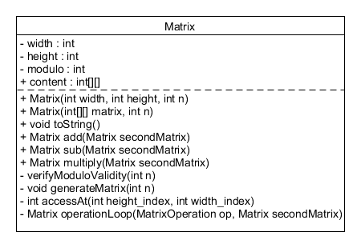

# Rapport Lab04

Ce rapport du Laboratoire 4 en POO présente une classe de matrice permettant
de créer des matrices de tailles variables et de réaliser des opérations comme l’addition,
la soustraction et la multiplication élément par élément. La conception est orientée objet pour faciliter l'ajout de potentielles nouvelles opérations.

Pour une représentation la manière dont les classes interagissent entre elles, voir la section "Diagramme de classes".

## Structure de la classe Matrix

### Attributs

- width : nombre de colonnes.
- height : nombre de lignes.
- modulo : modulo utilisé dans les calculs.
- content : un tableau bidimensionnel qui stocke le contenu de la matrice. Les colonnes contiennent les lignes.

### Constructeurs

1. Le premier constructeur prend en entrée la largeur, la hauteur et le modulo et initialise les éléments de la matrice avec des valeurs aléatoires entre 0 et n - 1.

2. Le deuxième constructeur prend en entrée un tableau bidimensionnel de int et un modulo afin d'initialiser la matrice avec des valeurs spécifiques.

### Méthodes principales

```generateMatrix(int n)```
Initialise la matrice avec des valeurs aléatoires comprises entre 0 et n-1.

```toString()```
Permet d'afficher le contenu de la matrice dans la console.

```accessAt(int height_index, int width_index)```
Retourne la valeur à une position donnée de la matrice. Si les indexes spécifiés n'existent pas pour la matrice, on retourne 0 à la place.

```operationLoop(MatrixOperation op, Matrix secondMatrix)``` Itère sur chaque élément de deux matrices et applique une opération entre les éléments de même positions. Si le modulo entre les deux matrices diffère, cette méthode lève une exception. Et si les deux matrices ne sont pas de même taille, les valeurs manquantes seront remplacées par des 0 grâce à accessAt(). Cette méthode n'est pas utilisable depuis l'extérieur de la classe.

```add/sub/multiply(Matrix secondMatrix)``` Appliquent respectivement l'addtion, la soustraction ou la mutiplication (modulaire) de la présente matrice avec une seconde matrice donnée en argument.

### Opérations de matrice

Les opérations sur les matrices sont rendues possibles grâce aux classes Addition, Subtraction, et Multiplication, qui sont toute une implémentation de la classe abstraire MatrixOperation, et qui sont utilisées dans les méthodes add, sub, et multiply vues plus haut.
Chaque opération est utilisée par la méthode operationLoop, qui reçoit une instance de la classe abstraite MatrixOperation et appelle la méthode apply qui effectuera le code correspondant a la classe dérivée.

1. Classe Addition : effectue une addition modulaire des éléments.
2. Classe Subtraction : effectue une soustraction modulaire des éléments.
3. Classe Multiplication : effectue une multiplication modulaire des éléments.

## Diagramme de classes



## Code sources

Ci-après, le code source de notre implémentation. À noter que dans le rendu sur Cyberlearn, du code a été volontairement laissé en commentaires dans Main.java pour pouvoir rapidement tester l'exemple présenté dans la donnée.

```java
// Main.java
package ch.heigvd.poo;

import ch.heigvd.poo.Matrix;

public class Main {
    public static void main(String[] args) {
        if (args.length < 5) {
            System.out.println("Usage: <N1> <M1> <N2> <M2> <modulo>");
            return;
        }
        int N1 = Integer.parseInt(args[0]);
        int M1 = Integer.parseInt(args[1]);
        int N2 = Integer.parseInt(args[2]);
        int M2 = Integer.parseInt(args[3]);
        int modulo = Integer.parseInt(args[4]);

        Matrix matOne = new Matrix(N1, M1, modulo);
        Matrix matTwo = new Matrix(N2, M2, modulo);

        System.out.println("The modulus is " + modulo + "\n");

        System.out.println("one");
        System.out.println(matOne);

        System.out.println("two");
        System.out.println(matTwo);

        Matrix mat3 = matOne.add(matTwo);
        System.out.println("one + two");
        System.out.println(mat3);

        Matrix mat4 = matOne.sub(matTwo);
        System.out.println("one − two");
        System.out.println(mat4);

        Matrix mat5 = matOne.multiply(matTwo);
        System.out.println("one x two");
        System.out.println(mat5);
    }
}
```

```java
//Matrix.java
package ch.heigvd.poo;

import java.util.Random;
import java.lang.Math;

public class Matrix {
    int width;  // M
    int height; // N
    int modulo;

    int[][] content;    // columns contain rows
    public Matrix(int width, int height, int n) throws RuntimeException {
        verifyModuloValidity(n);

        this.width = width;
        this.height = height;
        this.modulo = n;
        this.content = new int[height][width];
        generateMatrix(n);
    }

    public Matrix(int[][] matrix_content, int n) throws RuntimeException{
        verifyModuloValidity(n);

        int lineSize = matrix_content[0].length;
        for (int[] ints : matrix_content) {
            if (ints.length != lineSize)
                throw new RuntimeException("Incompatible line sizes");
        }

        this.content = matrix_content;
        this.height = matrix_content.length;
        this.width = matrix_content[0].length;  // matrix_content[0] always exists since we ask for two-dimensional table
        this.modulo = n;
    }

    private void verifyModuloValidity(int n) throws RuntimeException{
        if (n == 0){
            throw new RuntimeException("Can not do mod 0");
        }
    }

    private void generateMatrix(int n) {
        Random rand = new Random();
        for (int i = 0; i < height; i++){
            for (int j = 0; j < width; j++){
                this.content[i][j] = rand.nextInt(n);
            }
        }
    }

    public String toString(){
        String result = "";
        for (int i = 0; i < height; i++){
            for (int j = 0; j < width; j++){
                result += (j == 0 ? "" : " ") + content[i][j] ;
            }
            result += (i == height - 1 ? "" : "\n" );
        }
        return result;
    }

    private int accessAt(int height_index, int width_index){
        if (height_index < this.height && width_index < this.width){
            return this.content[height_index][width_index];
        }
        return 0;
    }


    private Matrix operationLoop(MatrixOperation op, Matrix secondMatrix) throws RuntimeException{
        if (this.modulo != secondMatrix.modulo){
            throw new RuntimeException("Not the same modulo");
        }
        Matrix res = new Matrix(secondMatrix.width, secondMatrix.height,1); // de la même taille que les deux autres
        int maxHeight = Math.max(height, secondMatrix.height);
        int maxWidth = Math.max(width, secondMatrix.width);
        for (int i = 0; i < maxHeight; i++) {
            for (int j = 0; j < maxWidth; j++) {
                int a = this.accessAt(i, j);
                int b = secondMatrix.accessAt(i, j);
                int c = op.apply(a, b, this.modulo);

                res.content[i][j] = c;
            }
        }
        return res;
    }

    public Matrix add(Matrix secondMatrix) throws RuntimeException{
        Addition addOp = new Addition();
        return this.operationLoop(addOp, secondMatrix);
    }

    public Matrix sub(Matrix secondMatrix) throws RuntimeException{
        Subtraction subOp = new Subtraction();
        return this.operationLoop(subOp, secondMatrix);
    }

    public Matrix multiply(Matrix secondMatrix) throws RuntimeException{
        Multiplication mulOp = new Multiplication();
        return this.operationLoop(mulOp, secondMatrix);
    }

}

```

```java
//MatrixOperation.java
package ch.heigvd.poo;
import java.lang.Math;

abstract class MatrixOperation {
    public abstract int apply(int a, int b, int modulo);
}

class Addition extends MatrixOperation{
    public int apply(int a, int b, int modulo){
        return Math.floorMod(a + b, modulo);
    }
}

class Subtraction extends MatrixOperation{
    public int apply(int a, int b, int modulo){
        return Math.floorMod(a - b, modulo);
    }
}

class Multiplication extends MatrixOperation{
    public int apply(int a, int b, int modulo){
        return Math.floorMod(a * b, modulo);
    }
}

```
