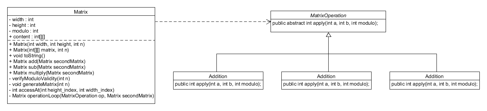

# Rapport Lab04

Ce rapport du Laboratoire 4 en POO présente une classe de matrice permettant 
de créer des matrices de tailles variables et de réaliser des opérations comme l’addition,
 la soustraction et la multiplication élément par élément. La conception est orientée objet
  pour faciliter l'ajout d'opérations.


## Structure de la classe Matrix
- width : nombre de colonnes.
- height : nombre de lignes.
- modulo : modulo utilisé dans les calculs.
- content : un tableau bidimensionnel qui stocke le contenu de la matrice.
### Constructeurs
1. Le premier constructeur prend en entrée la largeur, la hauteur et le modulo et initialise les éléments de la matrice avec des valeurs aléatoires entre 0 et n - 1.
2. Le deuxième consteur prend en entrée le contenu d'une autre matrice et un modulo afin d'initialiser la matrice avec des valeurs spécifiques.
### Méthodes principales
```generateMatrix(int n)```
Initialise la matrice avec des valeurs aléatoires comprises entre 0 et n-1.

```displayMatrix()```
Affiche le contenu de la matrice dans la console.

```accessAt(int height_index, int width_index)```
Retourne la valeur d’un élément donné de la matrice.

```Méthode loop(MatrixOperation op, Matrix secondMatrix)``` Itère sur chaque élément de deux matrices de même dimension et applique une opération : addition, soustraction ou multiplication. Si le modulo entre les deux matrices diffère, cette méthode lève une exception.

### Opérations de matrice
La classe Matrix fournit trois méthodes : addition, soustraction et multiplication de matrices. Chaque opération est faite avec la méthode loop, qui reçoit une instance de la classe abstraite MatrixOperation et appelle la méthode apply qui effectuera le code correspondant a la classe dérivée.

1. Classe Addition : effectue une addition modulaire des éléments.
2. Classe Subtraction : effectue une soustraction modulaire des éléments.
3. Classe Multiplication : effectue une multiplication modulaire des éléments.

## Diagramme de class



